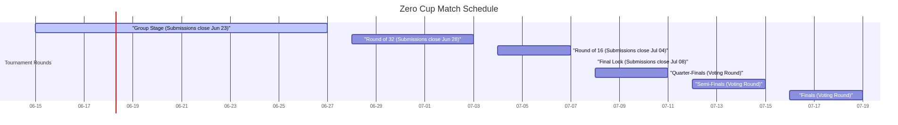
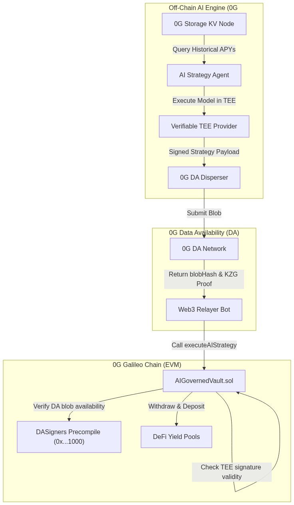

# 🏆 CogniVault: AI-Governed ERC-4626 Yield Optimizer
## Project Blueprint & Technical Documentation

CogniVault is an AI-governed, decentralized yield optimizer built on the **0G (Zero Gravity) Stack**. It utilizes **0G Storage** for historical context, **0G Compute** for verifiable off-chain strategy inference in a Trusted Execution Environment (TEE), and **0G Data Availability (DA)** for trustless, low-cost on-chain strategy verification. The core vault contract is fully EVM-compatible and runs on the **0G Galileo Testnet**.

---

## 1. Zero Cup Tournament Snapshot

The **Zero Cup** is a World Cup-style knockout tournament where teams improve and iterate their projects across six distinct rounds.

### Schedule & Deadlines
Every deadline represents a hard cut. At each milestone, a snapshot of the repository is frozen for evaluation. No code changes are allowed for a round after its corresponding deadline.

*   **Group Stage (June 15 – 27):** Open submission phase. All entries are reviewed by judges. The top 32 projects advance. **Submission Deadline: June 23.**
*   **Round of 32 (June 28 – July 3):** The knockout tournament begins. 32 projects compete head-to-head. The top 16 advance. **Submission Deadline: June 28.**
*   **Round of 16 (July 4 – 7):** The final round evaluated by technical judges. 16 projects compete. The top 8 reach the knockouts. **Submission Deadline: July 4.**
*   **Quarter Finals & The Final Lock (July 8 – 11):** **Absolute code freeze on July 8.** The snapshot locked on this date is used for the rest of the tournament. Community voting begins. The top 4 advance.
*   **Semi Finals (July 12 – 15):** 4 projects remain. Public voting selects the final 2.
*   **Finals (July 16 – 19):** Head-to-head community showdown to crown the Zero Cup Champion.

### Prize Ladder
Prizes stack as the project advances through the tournament rounds.
*   **Top 8 (Quarter-Finalists):** Guaranteed **$500** per project.
*   **Top 4 (Semi-Finalists):** Additional **$1,000** per project (Total: $1,500).
*   **Top 2 (Finalists):** Additional **$2,000** per project (Total: $3,500).
*   **Champion:** Additional **$5,000** grand prize (Total: **$8,500**).

---

## 2. Core Rules that Matter

1.  **AI-Native on 0G (Strict Rule):** The core value proposition of the app must depend on 0G's storage, compute, or DA layers. A simple wrapper that could run without 0G will be disqualified.
2.  **Vibe Coding Era Rules:** Leveraging generative AI models and copilots for development is fully encouraged. However, plagiarism, copying other entrants, or faking functionality (vaporware) will result in immediate disqualification.
3.  **Active Build Requirement:** Development must occur actively inside the repository within the hackathon window.
4.  **Submission Deliverables:** A public GitHub repository and a functional demo (live link or walkthrough video) matching the latest snapshot are required.

---

## 3. The Idea: CogniVault

### The Problem
Traditional DeFi yield aggregators (e.g., Yearn Finance, Beefy) suffer from severe architectural limitations:
*   **Inflexibility:** Rebalancing strategies are defined by static, human-coded smart contract logic, which cannot adapt to short-term yield spikes or sudden liquidity pool depegs.
*   **Centralization Vectors:** "Dynamic" aggregators rely on centralized Web2 keepers or developer-controlled multisigs to push manual strategy reallocations.
*   **High Gas Fees:** Running complex off-chain math (e.g., portfolio optimization, covariance matrix calculation) directly on-chain is cost-prohibitive.

### The CogniVault Solution
CogniVault addresses these issues by decoupling strategy computation from on-chain execution using the **0G modular stack**:
1.  An off-chain **AI Agent** constantly ingests global pool data (APYs, TVL, volume) from **0G Storage**.
2.  The Agent calculates the optimal allocation vector using a machine learning model executed inside a verifiable TEE on **0G Compute**.
3.  The strategy and cryptographic execution proofs are submitted to **0G DA**, generating a secure, cheap commitment.
4.  The on-chain ERC-4626 contract (`AIGovernedVault`) verifies the DA proof and the TEE signature. If valid, the vault rebalances autonomously without any human intervention.

---

## 4. Technical Architecture Overview

CogniVault bridges off-chain AI inference with on-chain EVM execution through modular 0G components.

### Component Details & 0G Alignment

#### A. Data Context Layer: 0G Storage
*   **Role:** Acts as the permanent database for historical yield metrics, pool depths, and risk vectors across different chains.
*   **Implementation:** The AI agent reads historical data from a 0G Storage KV node and writes its output logs back to 0G Storage.
*   **Tech Stack:** `@0gfoundation/0g-storage-ts-sdk` using the `ZgFile` and `Indexer` clients to upload/download datasets with Merkle proof verification.

#### B. Execution & Inference Layer: 0G Compute
*   **Role:** Executes the AI model to calculate optimal rebalancing allocations without exposing private model parameters or allowing relayer manipulation.
*   **Implementation:** The AI agent runs on the 0G Compute Network inside a Trusted Execution Environment (TEE).
*   **Verification:** The compute provider signs the execution output. The on-chain contract validates this signature, or off-chain systems verify it using the `processResponse` method in the `@0gfoundation/0g-compute-ts-sdk` broker client.

#### C. Data Availability Layer: 0G DA
*   **Role:** Cryptographically guarantees that the full strategy payload (allocations, target pools, timestamp) is published and readable by anyone, preventing data withholding attacks by the relayer.
*   **Implementation:** The strategy is dispersed to the 0G DA Disperser, returning a `blobHash` and a KZG polynomial proof.
*   **Verification:** Verified on-chain via the precompiled `DASigners` contract (at address `0x0000000000000000000000000000000000001000`) or the DA Entrance Contract (`0x857C0A28A8634614BB2C96039Cf4a20AFF709Aa9` on Galileo Testnet).

#### D. Consensus & Asset Layer: 0G Chain (Galileo Testnet)
*   **Network Parameters:**
    *   **Network Name:** `0G-Galileo-Testnet`
    *   **Chain ID:** `16602` (hex: `0x40EA`)
    *   **RPC Endpoint:** `https://evmrpc-testnet.0g.ai`
    *   **Block Explorer:** `https://chainscan-galileo.0g.ai`
    *   **Wrapped Native Token (W0G) Contract:** `0x1Cd0690fF9a693f5EF2dD976660a8dAFc81A109c`
*   **Contracts:**
    *   `AIGovernedVault.sol`: An ERC-4626 compliant vault that holds assets and handles user deposits/withdrawals. It exposes `executeAIStrategy` which verifies the DA proof and TEE signature before reallocating funds.

---

## 5. Build Roadmap

Our implementation is divided into four iterative milestones matching the Zero Cup timeline.

### Iteration 1: Foundation & Frontend WOW Factor (Deadline: June 23)
*   **Goal:** Establish the smart contract architecture, build the off-chain AI strategy simulator, and design a premium UI dashboard to secure a Top 32 position.
*   **Tasks:**
    1.  Initialize project repository with a monorepo setup (`/contracts` using Foundry, `/frontend` using Vite/React).
    2.  Write `AIGovernedVault.sol` (ERC-4626) with mock proof verification.
    3.  Develop a Python AI Agent simulator that generates strategy payloads and calculates mock BLS/ECDSA signatures.
    4.  Create a gorgeous React/CSS dashboard visualizing:
        *   Current portfolio allocations (doughnut chart, smooth animations).
        *   AI "thought process" logs (e.g., APY comparison table, risk scores, historical metrics).
        *   A step-by-step visualizer showing the data flow: Storage -> Compute -> DA -> EVM.
        *   A demo button to manually trigger a rebalance via a mock transaction.

### Iteration 2: 0G Storage Integration (Deadline: June 28)
*   **Goal:** Integrate real 0G Storage to prove technical depth to the judges.
*   **Tasks:**
    1.  Deploy a script that periodically aggregates DeFi APY data and uploads it as a `ZgFile` to 0G Storage.
    2.  Configure the AI Agent to pull these historical datasets directly from 0G Storage nodes, verify the Merkle proofs, and ingest them as model context.
    3.  Store AI rebalance run logs directly on 0G Storage.

### Iteration 3: 0G Compute TEE Verification (Deadline: July 4)
*   **Goal:** Secure the computation loop by validating that strategies were generated inside a TEE.
*   **Tasks:**
    1.  Incorporate the `@0gfoundation/0g-compute-ts-sdk` into our backend to query 0G Compute providers.
    2.  Verify the TEE responses using the Broker SDK (`broker.inference.processResponse`).
    3.  Implement TEE node signature registration in the Solidity contracts. The vault will verify that the strategy payload was signed by a registered, active TEE public key before execution.

### Iteration 4: 0G DA Verification & Live Relayer (Deadline: July 8)
*   **Goal:** Complete the end-to-end trustless loop and lock the code snapshot for community voting.
*   **Tasks:**
    1.  Integrate the Go/TypeScript DA client to submit strategy payloads to the 0G DA Disperser (`0x857C0A28A8634614BB2C96039Cf4a20AFF709Aa9`).
    2.  Implement the full on-chain verifier using the `DASigners` precompile (`0x...1000`) or Entrance contract to check blob inclusion proofs on-chain.
    3.  Deploy a live Relayer bot that listens for new strategies on DA and executes them on-chain.
    4.  Enable live, interactive rebalancing on the frontend where users can trigger the entire pipeline in real-time on Galileo Testnet.

---

## 6. Risks & Mitigations

| Risk | Impact | Mitigation Strategy |
| :--- | :--- | :--- |
| **0G DA Dispersal Latency** | **Medium:** Rebalancing transactions might fail if the proof is not finalized in time (strategies expire after 1 hour). | *Mitigation:* We will implement a flexible timestamp window (e.g., 2 hours) and optimize client-side disperser polling intervals. |
| **TEE Node Offline / Liveness** | **High:** If TEE nodes go offline, the vault cannot verify execution, preventing rebalances. | *Mitigation:* We will support a consensus mechanism (requiring signatures from 2 out of 3 TEE nodes) and include a governance-controlled emergency manual override. |
| **Front-Running & Sandwich Attacks** | **High:** Relayers submitting rebalance transactions could be front-run on the DEXes, causing massive slippage. | *Mitigation:* The contract will enforce strict maximum slippage limits (e.g., 0.5% max impact) based on oracle price feeds (e.g., Pyth or Chainlink) and leverage DEX aggregators rather than a single pool. |
| **Model Drift / Storage Data Poisoning** | **Medium:** Malicious nodes uploading corrupted data to 0G Storage could lead the AI model to make bad asset allocations. | *Mitigation:* Ingested datasets must be signed by recognized oracle keys or trusted data providers. The vault will also enforce strict allocation bounds (e.g., no single pool can receive >50% of TVL). |
